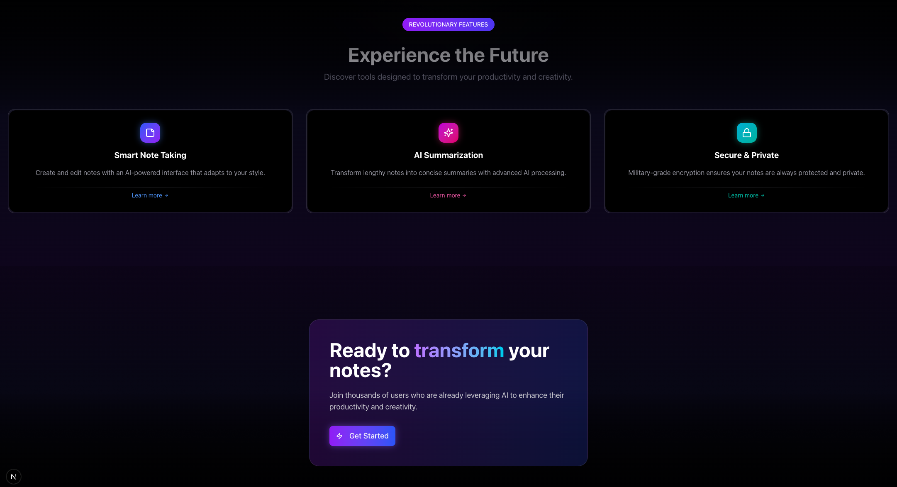
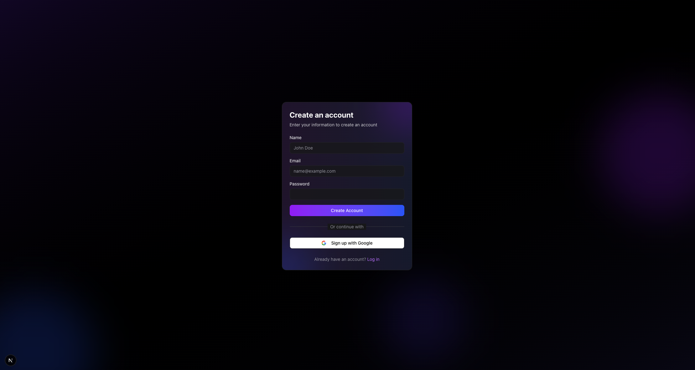
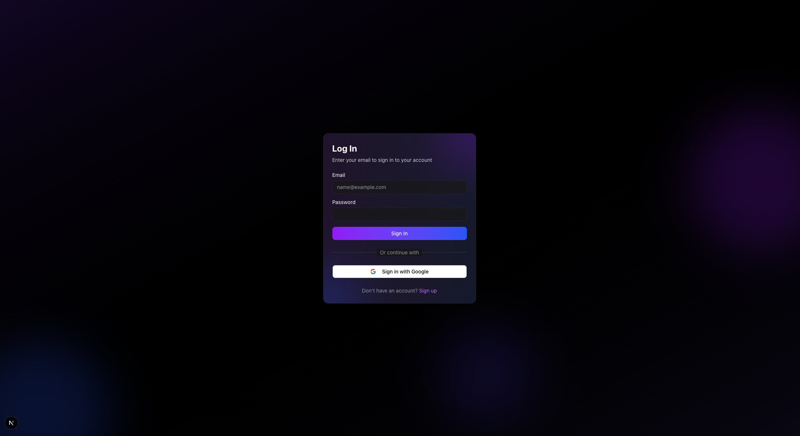
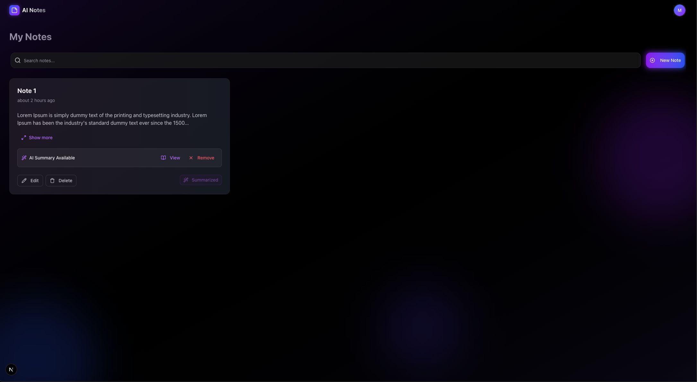

# AI Notes

A smart, AI-powered note-taking app that helps you create, edit, delete, and summarize notes with ease.

## Features

- ✍️ Create and edit notes with a clean, intuitive interface
- 🗑️ Delete notes you no longer need
- 🤖 Summarize notes using AI assistance


## Getting Started

1. Clone the repository  
2. Install dependencies:

```bash
npm install
```

3. Create a .env.local file in the root and add the following variables:

```bash
GROQ_API_KEY=your_groq_api_key
NEXT_PUBLIC_SUPABASE_ANON_KEY=your_supabase_anon_key
NEXT_PUBLIC_SUPABASE_URL=your_supabase_url
```

4. Set Up the Database  
    - Open your Supabase project  
    - Go to the **SQL Editor**  
    - Copy and paste the contents of [`postgres.sql`](./postgres.sql) into the editor  
    - Click **Run** to set up your database schema and policies


5. Run the development server:

```bash
npm run dev
# or
yarn dev
# or
pnpm dev
# or
bun dev
```

Open [http://localhost:3000](http://localhost:3000) with your browser to see the result.

## Screenshots

### Homepage





### Sign Up



### Sign In



### Dashboard



## Learn More

To learn more about Next.js, take a look at the following resources:

- [Next.js Documentation](https://nextjs.org/docs) - learn about Next.js features and API.
- [Learn Next.js](https://nextjs.org/learn) - an interactive Next.js tutorial.

You can check out [the Next.js GitHub repository](https://github.com/vercel/next.js) - your feedback and contributions are welcome!

## Deploy on Vercel

The easiest way to deploy your Next.js app is to use the [Vercel Platform](https://vercel.com/new?utm_medium=default-template&filter=next.js&utm_source=create-next-app&utm_campaign=create-next-app-readme) from the creators of Next.js.

Check out our [Next.js deployment documentation](https://nextjs.org/docs/app/building-your-application/deploying) for more details.